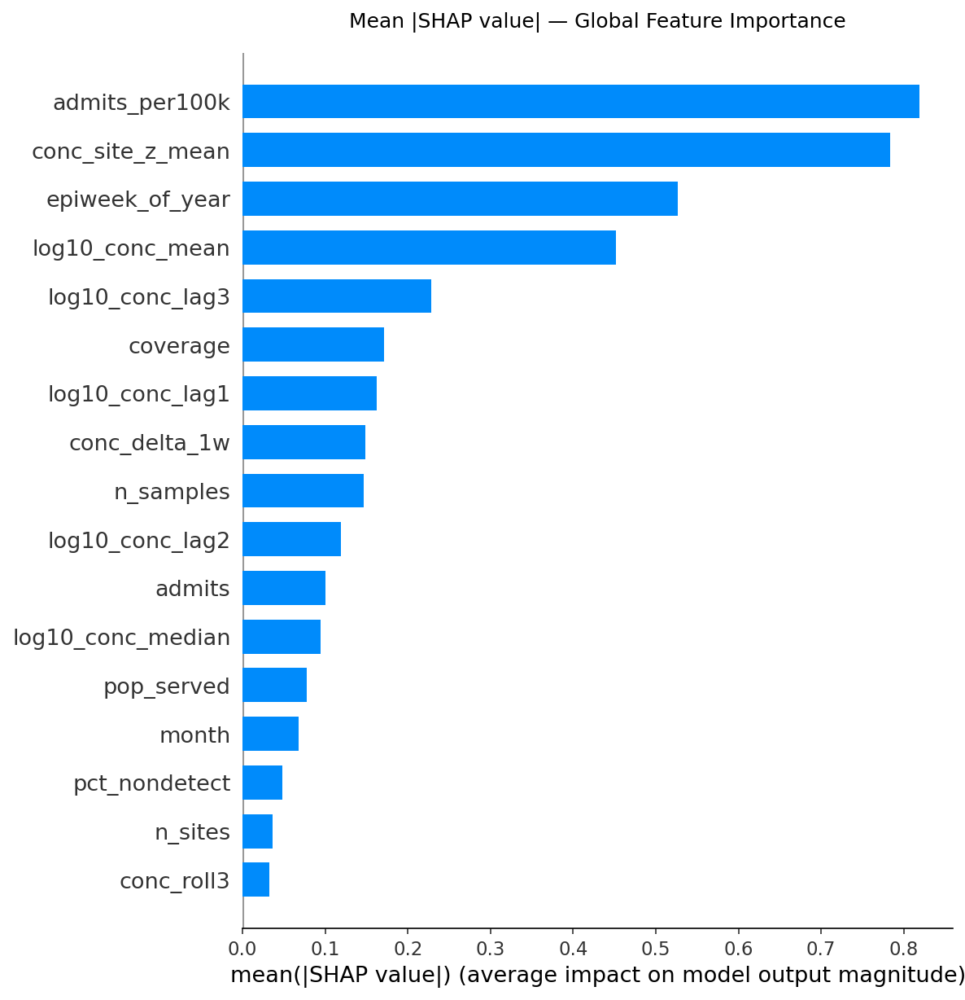
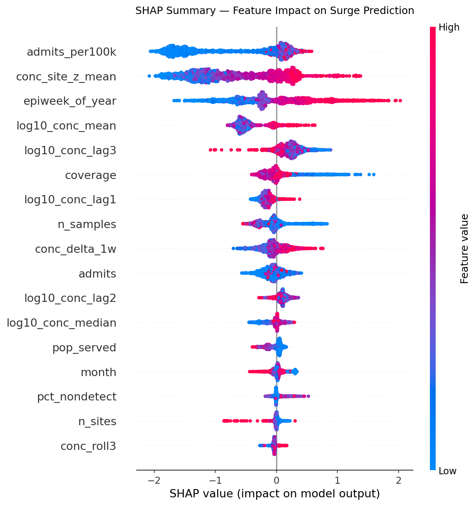
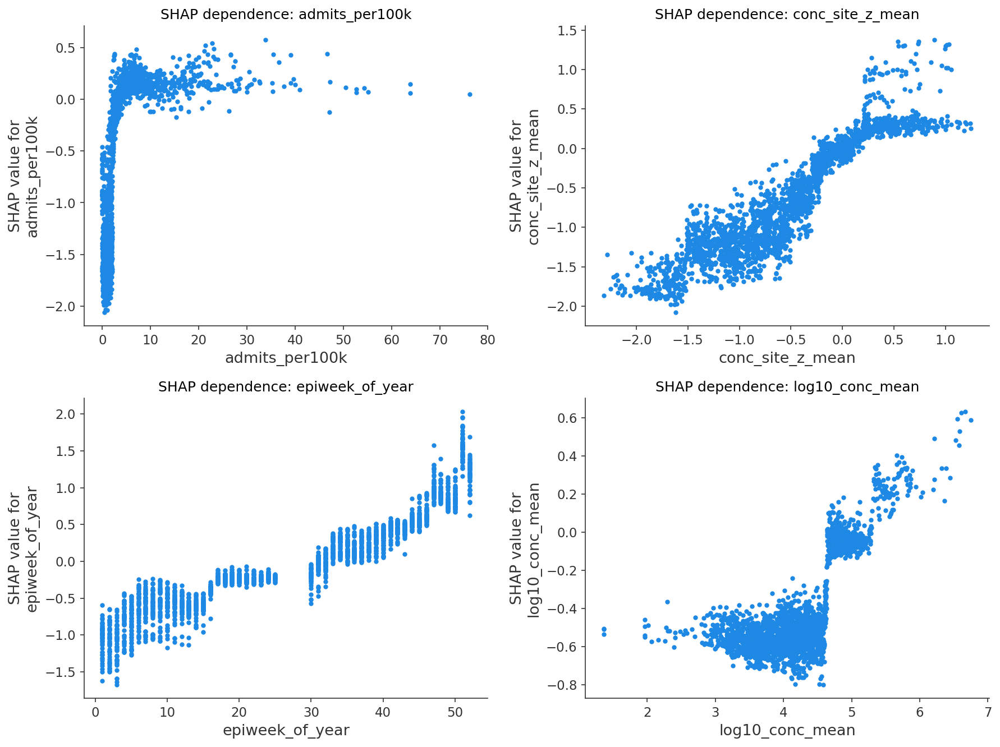
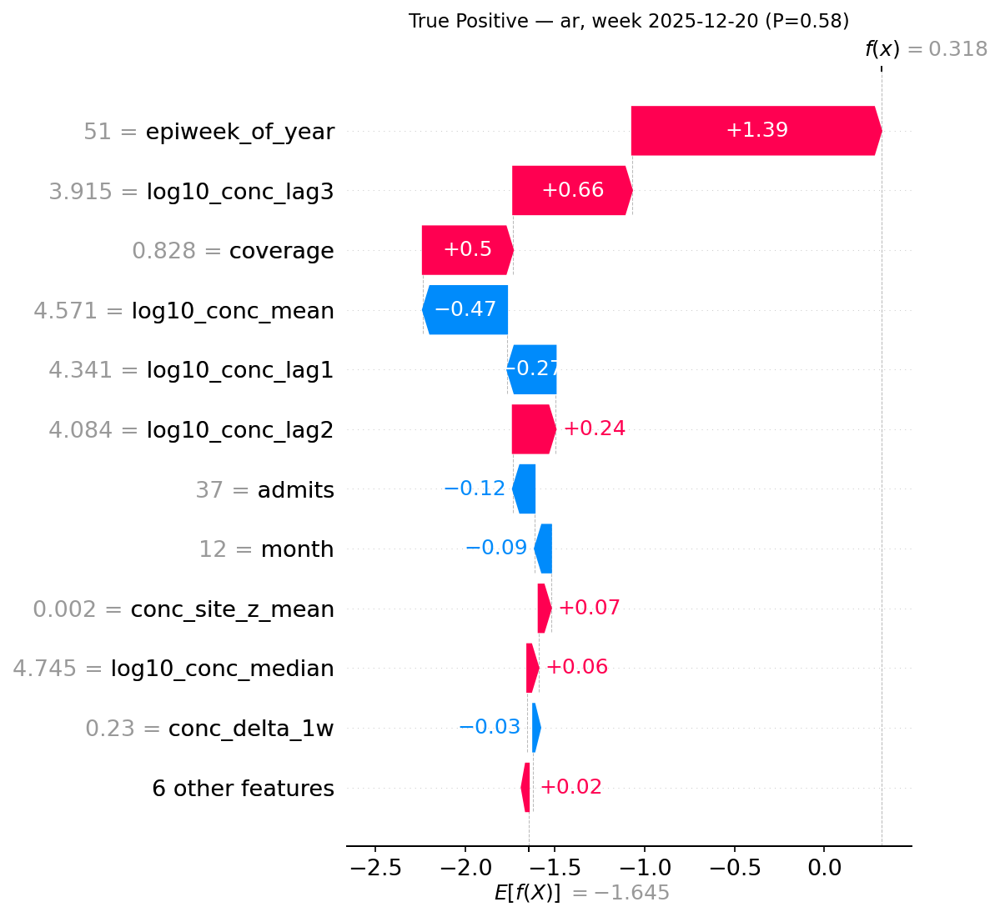
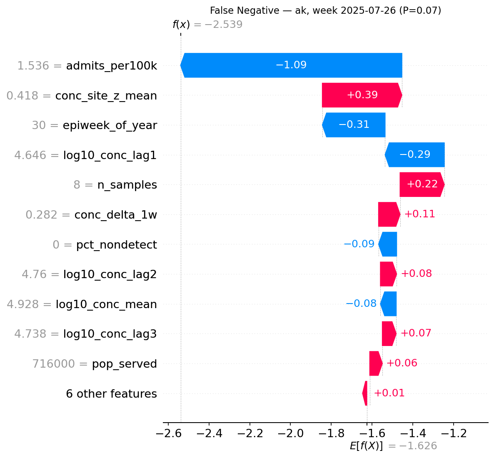

# Model Explainability — SHAP Analysis

Explains *why* the final XGBoost pipeline (`final_model/surge_prediction_pipeline.pkl`) makes
the predictions it does — which features drive surge/no-surge calls, in which direction, and
where the model tends to succeed or fail. Companion to `FINAL_MODEL.md` (what the model is)
and `model_evaluation.md` (how well it performs).

**Method:** `shap.TreeExplainer` on the saved XGBoost pipeline, run on the 2,269-row held-out
test set (`feature_matrix_era2022.csv` + `targets_era2022.csv`, `split_era == "test"`). Before
running SHAP, I reloaded the pipeline and re-scored the real test set to confirm it reproduces
`pipeline_test_metrics.json` exactly (accuracy 0.957, ROC-AUC 0.869, confusion matrix
TP 21 / FP 31 / FN 67 / TN 2150) — so the explanations below are for the actual shipped model,
not a re-trained stand-in.

---

## 1. Global feature importance

Ranked by mean |SHAP value| across all 2,269 test-set predictions — how much each feature
moves the model's output (in log-odds of surge) on average, up or down.

| Rank | Feature | Mean \|SHAP\| | What it is |
|---|---|---|---|
| 1 | `admits_per100k` | 0.819 | This week's admissions, population-normalized |
| 2 | `conc_site_z_mean` | 0.784 | Wastewater level vs. *that site's own* historical baseline |
| 3 | `epiweek_of_year` | 0.527 | Calendar week (seasonality) |
| 4 | `log10_conc_mean` | 0.452 | Raw wastewater concentration, log-scaled |
| 5 | `log10_conc_lag3` | 0.228 | Wastewater signal 3 weeks ago |
| 6 | `coverage` | 0.172 | Fraction of hospitals reporting that week |
| 7 | `log10_conc_lag1` | 0.163 | Wastewater signal 1 week ago |
| 8 | `conc_delta_1w` | 0.149 | Week-over-week change in wastewater signal |
| 9 | `n_samples` | 0.146 | Lab samples backing the row |
| 10 | `log10_conc_lag2` | 0.119 | Wastewater signal 2 weeks ago |
| 11 | `admits` | 0.100 | Raw (non-normalized) admissions this week |
| 12 | `log10_conc_median` | 0.095 | Median wastewater concentration |
| 13 | `pop_served` | 0.078 | Population covered by reporting plants |
| 14 | `month` | 0.068 | Calendar month |
| 15 | `pct_nondetect` | 0.049 | Fraction of samples below detection limit |
| 16 | `n_sites` | 0.036 | Number of reporting treatment plants |
| 17 | `conc_roll3` | 0.032 | 3-week rolling average wastewater signal |

**Takeaways:**

- Current hospital load (`admits_per100k`) and the wastewater *z-score* dominate — together
  they account for roughly a third of total feature impact. This lines up with EDA
  finding that `admits_this_week` correlates 0.98 with next-week admits, and with the boxplot
  showing `conc_site_z_mean` is visibly higher in surge weeks than non-surge weeks.
- The *normalized* wastewater signal beats the *raw* one: `conc_site_z_mean` (rank 2) far
  outranks `log10_conc_mean` (rank 4) and `conc_roll3` (rank 17, last). The model relies on
  "is this unusual for this specific site," not "is the raw number big" — matching the design
  intent in `DATA_CLEANING.md` (raw concentration isn't comparable across plants/labs).
- Seasonality matters more than any single wastewater lag — `epiweek_of_year` outranks all
  three lag features individually.
- `conc_roll3`, despite being engineered specifically to smooth wastewater noise, contributes
  almost nothing. It's highly correlated with `log10_conc_mean` (r = 0.98), so XGBoost likely
  treats one as a stand-in for the other.

---

## 2. How individual features push predictions

- `admits_per100k`: sharply nonlinear. Impact stays near zero for low-to-moderate admission
  rates, then rises steeply past a threshold — the model doesn't raise surge risk until
  hospitals are already under real, elevated load.
- `conc_site_z_mean`: more gradual and consistent — impact rises steadily as the wastewater
  reading gets more unusual relative to a site's own baseline.
- `epiweek_of_year`: non-monotonic — impact rises and falls across the year rather than
  trending in one direction, consistent with seasonality rather than a simple time trend.
- `log10_conc_mean`: positive at high concentrations but noisier/more scattered than the
  z-score version.

---

## 3. Local examples: a catch and a miss

### Correctly flagged surge (true positive)
**Connecticut, week ending 2025-12-20 — model probability 0.74**

Elevated `admits_per100k` and a high `conc_site_z_mean` both push the prediction well above
the base rate, and the model correctly flags this as a surge week.

### Missed surge (false negative)
**Alaska, week ending 2025-07-26 — model probability 0.07**

A real surge that the model almost entirely missed. The wastewater z-score and admissions
rate were both unremarkable *relative to Alaska's own recent baseline* going into that week,
so the model saw nothing unusual — even though a surge happened. This is a concrete example
of the recall problem flagged in `FINAL_MODEL.md`: the model needs the signal to already look
abnormal before it reacts, so surges that emerge from an already-elevated or noisy baseline
(Alaska has some of the lowest `n_sites` coverage in the dataset) are the ones most likely to
slip through. This lines up with the low recall (0.24) noted in `FINAL_MODEL.md`.

---

## Files

- `SHAP_EXPLAINABILITY.md` — this document
- `shap/fig_shap_summary.png` — beeswarm plot, all 17 features
- `shap/fig_shap_importance_bar.png` — mean \|SHAP\| bar chart
- `shap/fig_shap_dependence_top4.png` — dependence plots for the top 4 features
- `shap/fig_waterfall_true_positive.png` — local explanation, correctly caught surge
- `shap/fig_waterfall_false_negative.png` — local explanation, missed surge

**Reproducibility:** SHAP values computed with `shap.TreeExplainer` directly on the XGBoost
step of `surge_prediction_pipeline.pkl`, using the same 17 features in the same order as
`pipeline_features.txt`, on the real `split_era == "test"` rows from
`feature_matrix_era2022.csv` joined to `targets_era2022.csv`. Test-set metrics reproduced
exactly from the pipeline before SHAP was run, confirming this analysis reflects the actual
final model.
