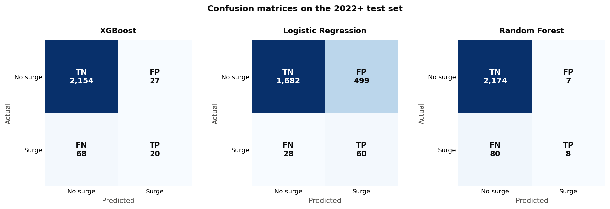
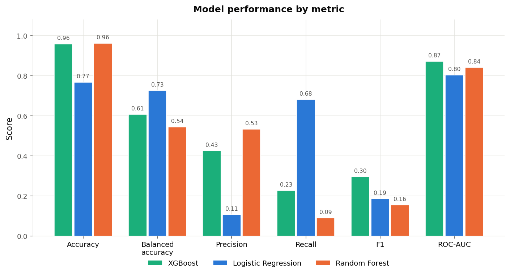
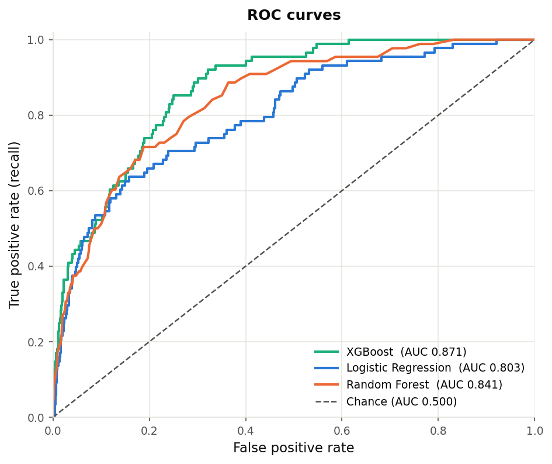
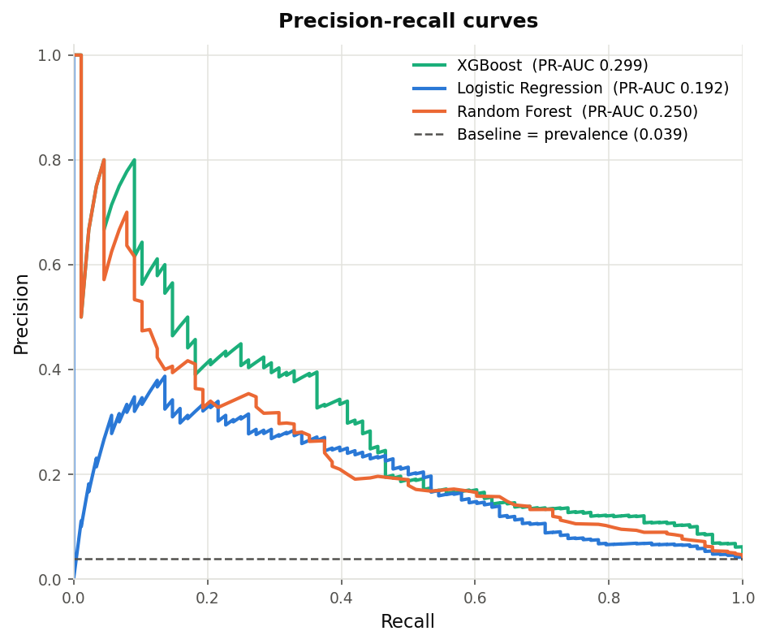

# Model Evaluation

My job was to evaluate the surge-prediction models, compare the baseline against the advanced ones with the right metrics (confusion matrices included), and write up where each one is strong and weak.

## What the models predict

It's binary classification. For each state and week we predict `y_surge_next_week`: is next week a COVID admissions surge? A surge is defined as next week rising more than 10% over this week AND landing above that state's median admissions.

I used the 2022+ dataset ([feature_matrix_era2022.csv](feature_matrix_era2022.csv) and [targets_era2022.csv](targets_era2022.csv)) with the `split_era` train/test flag. That's 6,860 training rows and 2,269 test rows across 17 features. Everything below is on the held-out test set.

To reproduce it, run `python evaluation/evaluate_models.py`. Outputs go to [evaluation/results/](evaluation/results/) and [evaluation/figures/](evaluation/figures/). The script re-fits the same models set up in [model_development/train_models.py](model_development/train_models.py) and saves the predicted probabilities, which you need for the ROC and PR curves.

## The big caveat: the classes are really imbalanced

Only 88 of the 2,269 test weeks (3.9%) are actual surges. This changes how you read every result. A model that just says "no surge" every week gets 96.1% accuracy and catches zero surges. Useless, but it looks great on accuracy alone. I put that exact model in the table below as the "Majority-class baseline" so nobody misses the point.

So accuracy is the wrong headline metric here. The ones that tell you whether we're catching surges are recall, precision, F1, balanced accuracy, ROC-AUC, and PR-AUC. Those are what to look at.

## Results

| Model | Accuracy | Balanced acc. | Precision | Recall | F1 | ROC-AUC | PR-AUC |
|---|---|---|---|---|---|---|---|
| Majority-class baseline (always "no surge") | 0.961 | 0.500 | 0.000 | 0.000 | 0.000 | n/a | n/a |
| Logistic Regression (baseline model) | 0.768 | 0.727 | 0.107 | 0.682 | 0.185 | 0.803 | 0.192 |
| Random Forest | 0.962 | 0.544 | 0.533 | 0.091 | 0.155 | 0.841 | 0.250 |
| XGBoost | 0.958 | 0.607 | 0.426 | 0.227 | 0.296 | 0.871 | 0.299 |

The PR-AUC no-skill baseline is the prevalence, 0.039, and the ROC-AUC no-skill baseline is 0.500. Full numbers with raw TP/FP/FN/TN counts are in [evaluation/results/evaluation_metrics.csv](evaluation/results/evaluation_metrics.csv).

### Confusion matrices

| Model | TN | FP | FN | TP | Read |
|---|---|---|---|---|---|
| Logistic Regression | 1,682 | 499 | 28 | 60 | Catches 60 of 88 surges but false-alarms 499 times |
| Random Forest | 2,174 | 7 | 80 | 8 | Almost never false-alarms but misses 80 of 88 surges |
| XGBoost | 2,154 | 27 | 68 | 20 | Middle ground, 20 caught against 27 false alarms |

## Baseline vs advanced

The accuracy column is where you get fooled. Random Forest's 0.962 is barely above the do-nothing baseline's 0.961, and it earns that almost entirely by predicting "no surge," which is right 96% of the time by default. Look one column over: its balanced accuracy is 0.544 (0.5 is a coin flip) and recall is 0.091, so it misses 91% of the real surges. High accuracy, near-useless model.

On the metrics that matter, the ranking depends on what you want the model to do. For overall ranking ability XGBoost wins, with the best ROC-AUC (0.871), PR-AUC (0.299), and F1 (0.296). In the ROC and PR plots its line sits above the others across almost the whole range, so if you tune its threshold you get the best precision/recall trade-off available. For actually catching surges Logistic Regression wins, with recall of 0.682 and balanced accuracy of 0.727, the highest of any model, flagging 60 of the 88 real surges. The `class_weight="balanced"` setting pushes it to favor catching positives.

I put both ROC and PR curves in for a reason. Under heavy imbalance ROC-AUC can look flattering because the big pile of true negatives inflates it. The precision-recall curve is the more honest view: the dashed line at 0.039 is the no-skill floor, all three models clear it, but the precision ceiling of roughly 0.4 to 0.5 shows how hard this problem actually is.

## Strengths and weaknesses

### Logistic Regression (the baseline)

Highest recall (0.682) and balanced accuracy (0.727), so it actually catches most surges. Fully interpretable through its coefficients, fast, and a legitimate baseline the advanced models have to beat. The downside is precision of only 0.107, so about 89% of its surge alarms are false positives (499 of them). It also has the lowest ROC-AUC and PR-AUC, so the underlying ranking is the weakest. It buys recall by flagging almost anything borderline. Best when missing a surge costs way more than a false alarm, like a public-health early-warning system where you'd rather over-prepare.

### Random Forest

Highest precision (0.533), so when it does call a surge it's right about half the time, and it almost never false-alarms (7 total). Handles the NaN lag features and non-linear interactions without extra work. But it's the weakest model here despite the best accuracy. Recall of 0.091 and balanced accuracy of 0.544 mean it misses 80 of 88 surges, so as an early-warning tool it barely does anything. Its default 0.5 threshold is badly miscalibrated for this imbalance and it collapses toward "always no surge." Best when false alarms are expensive and you only want the most confident calls, or after threshold tuning and resampling.

### XGBoost (best overall)

Best F1 (0.296), ROC-AUC (0.871), and PR-AUC (0.299), so it's the strongest overall and has the best-balanced confusion matrix (20 TP, 27 FP, 68 FN). Its probability outputs give the most room to tune the threshold to whatever trade-off the team wants. Still only 0.227 recall at the default threshold though, so it misses 68 of 88 surges. Good ranking, conservative default cutoff. Less interpretable than logistic regression, but the SHAP analysis covers that, and it needs the OpenMP runtime (`libomp`) installed to run. Best when you want the single strongest model and can tune the threshold. This is the one I'd carry forward.

## Bottom line

1. Report F1, ROC-AUC, PR-AUC, and recall as the headline numbers, not accuracy. Accuracy is dominated by the 96% "no surge" majority and makes a do-nothing model look strong.
2. XGBoost is the best overall, so it's the one to carry forward into the SHAP work and anything after.
3. No model is production-ready yet. Even the best PR-AUC is 0.30, and default recall is low for the strong-ranking models. Highest-value next steps for whoever picks this up:
   - Tune the decision threshold instead of leaving it at 0.5. Pick the operating point on XGBoost's PR curve that matches the precision/recall trade-off you want.
   - Try resampling or `scale_pos_weight` on XGBoost to lift recall the way `class_weight="balanced"` does for logistic regression.
   - Consider evaluating a regression on `y_reg_next_admits` as a second framing, since the binary surge label throws away the size of the jump.

## Files produced

| File | Contents |
|---|---|
| [evaluation/evaluate_models.py](evaluation/evaluate_models.py) | The evaluation script. Re-fits the models, captures probabilities, writes everything below. |
| [evaluation/results/evaluation_metrics.csv](evaluation/results/evaluation_metrics.csv) | Full metric table with TP/FP/FN/TN, balanced accuracy, specificity, PR-AUC. |
| [evaluation/results/predictions_with_proba.csv](evaluation/results/predictions_with_proba.csv) | Per-row test-set actual, prediction, and probability for each model. |
| [evaluation/results/confusion_matrices.txt](evaluation/results/confusion_matrices.txt) | Text confusion matrices with derived rates. |
| [evaluation/figures/confusion_matrices.png](evaluation/figures/confusion_matrices.png) | Confusion matrix per model. |
| [evaluation/figures/roc_curves.png](evaluation/figures/roc_curves.png) | ROC curves, all models on one plot. |
| [evaluation/figures/pr_curves.png](evaluation/figures/pr_curves.png) | Precision-recall curves, all models on one plot. |
| [evaluation/figures/metric_comparison.png](evaluation/figures/metric_comparison.png) | Grouped bar chart of the headline metrics. |
